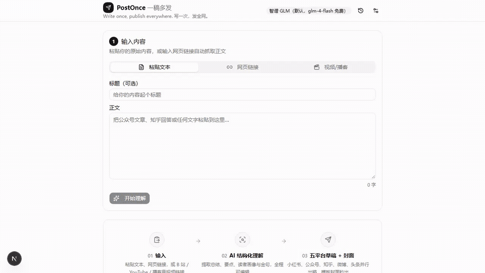
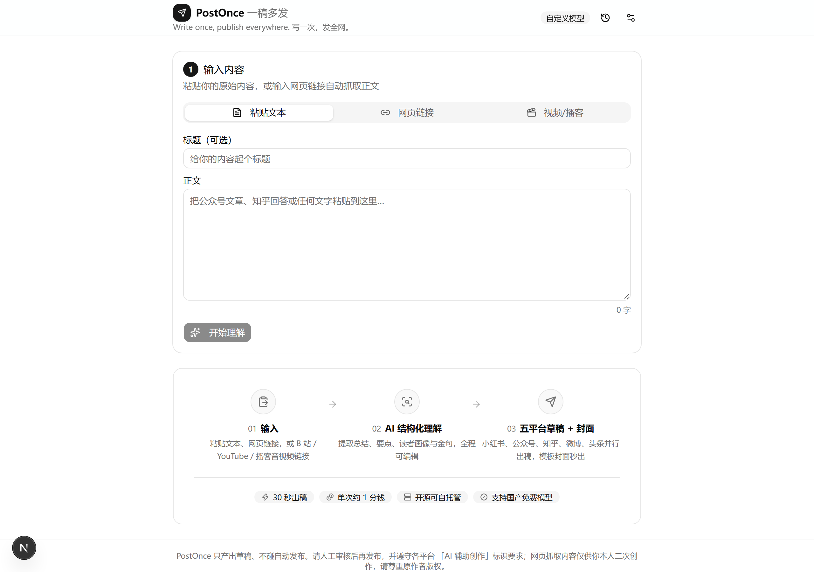
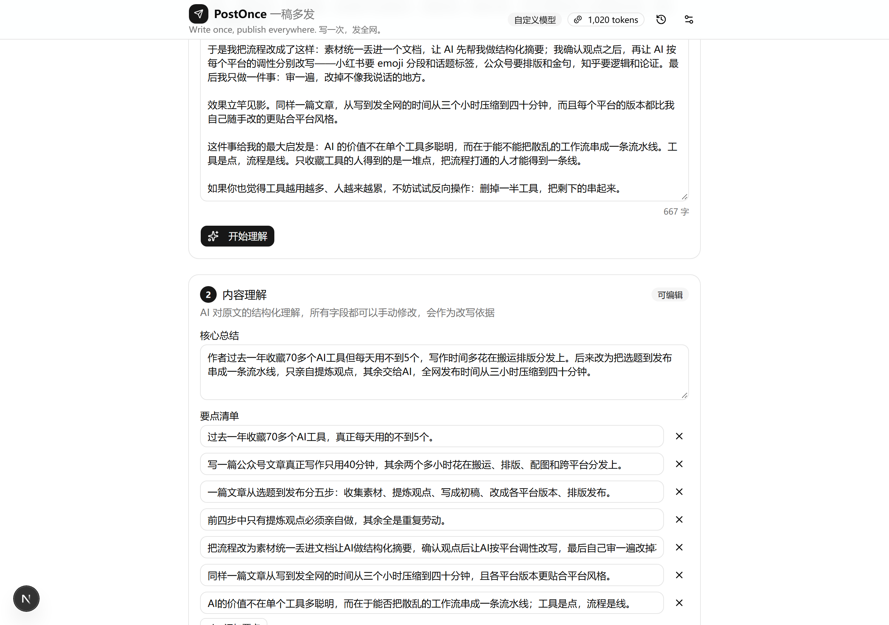
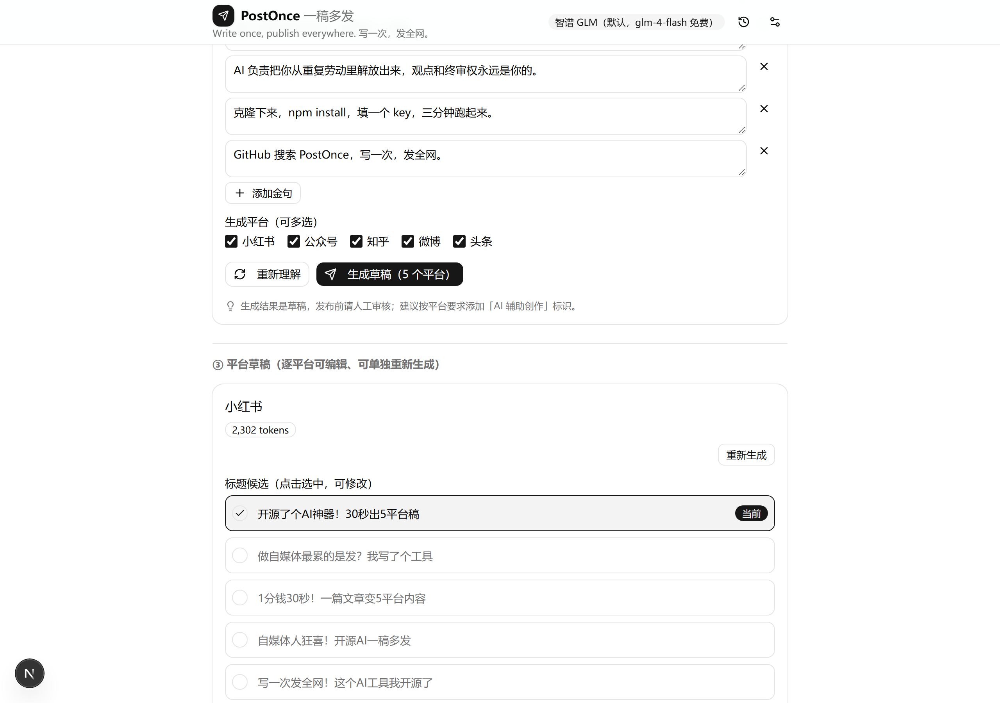
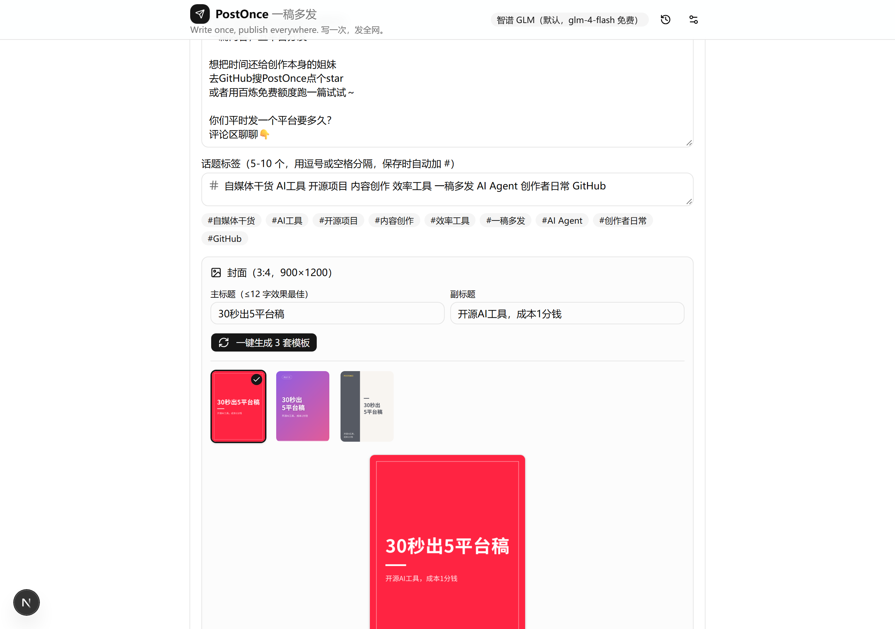

# PostOnce · 一稿多发

> **Write once, publish everywhere. 写一次，发全网。**

[](LICENSE)
[](https://nextjs.org/)
[](https://sdk.vercel.ai/)
[](CONTRIBUTING.md)

开源的 AI 跨平台内容二创 Agent：一次输入（**粘贴文本 / 网页链接 / 视频·播客**），自动产出适配**小红书、公众号、知乎、微博、头条**五个平台的发布级草稿——标题候选、正文、话题标签、3:4 封面、富文本排版，人工确认后一键复制导出。

**English**: PostOnce is an open-source AI content-repurposing agent. Feed it text, a URL, or a video/podcast link, and it drafts platform-native posts for Xiaohongshu, WeChat Official Accounts, Zhihu, Weibo and Toutiao — titles, body, tags, covers and rich-text layout, with pluggable OpenAI-compatible LLMs (BYOK supported). Built with Next.js App Router + Vercel AI SDK + satori + yt-dlp.



## 为什么做它

写一篇内容只要 40 分钟，改成五个平台的版本却要两小时——85% 的自媒体人把 60% 以上的时间耗在这种重复劳动上。PostOnce 把「改写、排版、配图、适配」这条流水线自动化：**AI 负责重复劳动，观点和终审权永远是你**。

## 演示

| ① 输入（文本 / 链接 / 视频） | ② AI 结构化理解（全字段可编辑） |
| --- | --- |
|  |  |

| ③ 五平台草稿（逐平台编辑/重生成） | ④ 封面工作台（一键三模板） |
| --- | --- |
|  |  |

## 功能

- **三通道输入**：粘贴文本；网页链接服务端抓取（桌面 UA + Readability + SSRF 防护）；**B 站 / YouTube / 音视频直链**提取音频并 ASR 转写为文字稿（yt-dlp + ffmpeg，90 分钟内，超长自动切片转写后拼接）
- **内容理解**：LLM 结构化输出总结 / 要点 / 目标读者 / 调性 / 金句，全部可编辑、可重新生成
- **五平台并行改写（可勾选、单平台失败互不影响）**：
  - 小红书：3-8 个 ≤20 字标题候选、emoji 分段口语化正文、5-10 个话题标签、封面文案
  - 公众号：3-8 个标题候选、内联样式富文本排版（小标题/引用块/加粗/分割线）、≤120 字摘要
  - 知乎：3-8 个问题式/观点式标题、Markdown 回答体正文（小标题+列表+加粗）
  - 微博：≤140 字短文案（前 20 字钩子）、话题词、可选长微博版本
  - 头条：3-8 个信息量标题、资讯感正文
- **模板封面**：3 套程序化模板（纯色大字 / 渐变 / 左右分栏），satori + resvg 秒出 900×1200 PNG，缩略图对比、可单独下载
- **人在回路**：每个产出块可编辑、可单独重新生成；不接任何自动发布 API
- **账单透明**：每次生成实时显示 token 用量
- **模型可插拔**：GLM / DeepSeek / 通义 / Kimi / OpenAI 预设（OpenAI 兼容接口），默认 GLM-Flash 免费模型；支持 BYOK（密钥仅存浏览器 localStorage）
- **无登录无数据库**：历史记录存浏览器 localStorage（最多 20 条）
- **内存限流**：单 IP 每日 50 次（`RATE_LIMIT_PER_DAY` 可调）

## 快速开始

```bash
npm install
cp .env.example .env.local   # 填入你的模型 API Key
npm run dev                  # http://localhost:3000
```

最小可用配置（不改代码、不用数据库）：

```ini
# .env.local
MODEL_PROVIDER=glm
GLM_API_KEY=你的智谱密钥        # glm-4-flash 目前免费；也可用其他预设，或在前端设置面板 BYOK
```

想用视频/播客输入？再加一行百炼密钥（[免费获取](https://bailian.console.aliyun.com/)）：

```ini
DASHSCOPE_API_KEY=你的百炼密钥   # ASR 转写与通义文本模型共用该密钥
```

生产构建：`npm run build && npm start`。

### 中文字体（封面渲染必需）

封面渲染（satori）需要 CJK 字体，且**仅支持 ttf/otf/woff，不支持 woff2/ttc**。仓库自带 `assets/fonts/NotoSansSC-Regular.ttf` 与 `NotoSansSC-Bold.ttf`（[Noto Sans SC](https://fonts.google.com/noto/fonts)，OFL 协议，可商用）。若字体文件缺失（如克隆时未包含），手动放置以下任一字体到 `assets/fonts/` 即可（代码按文件名自动探测）：

- `NotoSansSC-Regular.ttf` + `NotoSansSC-Bold.ttf`（推荐；可变字体 `NotoSansSC[wght].ttf` 需先用 `fonttools varLib.instancer` 实例化为静态字重，satori 无法解析 fvar 表）
- 或 `AlibabaPuHuiTi-3-55-Regular.ttf` / `AlibabaPuHuiTi-3-85-Bold.ttf`（阿里巴巴普惠体，免费商用）
- 或 `SourceHanSansSC-Regular.otf` / `SourceHanSansSC-Bold.otf`（思源黑体，OFL）

字体缺失时 `/api/cover` 会返回明确的中文错误提示，其余功能不受影响。

## 配置

**文本模型**：

| 环境变量 | 说明 |
|---|---|
| `MODEL_PROVIDER` | 预设厂商：`glm`（默认）/ `deepseek` / `qwen` / `kimi` / `openai` |
| `GLM_API_KEY` 等 | 各预设对应密钥（见 `.env.example`） |
| `RATE_LIMIT_PER_DAY` | 单 IP 每日请求上限，默认 50 |

前端「设置」面板支持 BYOK：填写 OpenAI 兼容的 baseURL / API Key / 模型名，仅存 localStorage，请求经自定义 header 传给后端，服务端不写日志。

**ASR（视频/播客转写）**：

| 环境变量 | 说明 |
|---|---|
| `ASR_PROVIDER` | `dashscope`（默认，qwen3-asr-flash）/ `groq` / `openai` |
| `ASR_BASE_URL` / `ASR_API_KEY` / `ASR_MODEL` | 三项全填时指向自定义 OpenAI 兼容转写端点（如自建 Whisper） |
| `MEDIA_MAX_MINUTES` | 视频时长上限，默认 90 分钟 |
| `MEDIA_EXTRA_HOSTS` | 追加视频平台白名单（逗号分隔） |
| `FFMPEG_PATH` / `YTDLP_PATH` | 手动指定二进制路径（默认自动探测） |

## API

| 方法 | 路由 | 说明 |
|---|---|---|
| `POST` | `/api/ingest` | `{url}` → 抓取并提取 `{title, content, excerpt, sourceUrl}` |
| `POST` | `/api/understand` | `{title, content}` → 结构化理解 + token usage |
| `POST` | `/api/adapt` | `{title, content, analysis, platforms[]}` → 并行产出各平台草稿，分平台成功/失败 |
| `POST` | `/api/transcribe` | `{url}` → 提取音频并 ASR 转写 → `{title, content, excerpt, sourceUrl, duration}` |
| `POST` | `/api/cover` | `{template, main, sub}` → `image/png` 封面（900×1200） |
| `GET` | `/api/config` | 服务端预设与密钥配置状态（不含密钥） |

## 视频 / 播客输入

支持 **B 站、YouTube** 链接（平台白名单，`MEDIA_EXTRA_HOSTS` 可追加），或直接粘贴 `.mp3/.m4a/.wav/.mp4/.mkv/.webm` 等音视频直链。流程：yt-dlp 提取音频（直链直接下载）→ ffmpeg 统一转 16kHz 单声道 mp3 64kbps（约 0.48MB/分钟）→ 超过 ASR 单片上限自动按时长切片 → 逐片转写后拼接 → 文字稿进入流水线。

实现要点：DashScope 兼容模式的 ASR 仅支持 qwen3-asr-flash 系列且不收本地文件路径，本项目按其官方文档用 base64 Data URL 上传，单片超 4 分钟自动切片；groq/openai 预设走标准 Whisper multipart 上传。

**二进制依赖**：`ffmpeg-static` 与 `yt-dlp-exec` 在 npm install 时自动下载二进制（GitHub Releases）。网络受限时可用镜像重装：`FFMPEG_BINARIES_URL=https://registry.npmmirror.com/-/binary/ffmpeg-static npm install ffmpeg-static`；yt-dlp 可经 `https://ghfast.top/https://github.com/yt-dlp/yt-dlp/releases/latest/download/yt-dlp.exe` 手动下载到 `node_modules/yt-dlp-exec/bin/`。若都失败，手动放置 `ffmpeg(.exe)`、`yt-dlp(.exe)` 到 `assets/bin/` 即可。

## 合规与声明

- 本项目**不接入任何平台的自动发布 API**，产出物均为草稿，请人工审核后再发布
- 请遵守各平台「AI 辅助创作」内容标识要求
- 网页抓取与视频/播客转写内容仅供你本人二次创作使用，请尊重原作者版权；受版权保护的内容请勿违规转载

## License

[Apache-2.0](LICENSE) · 欢迎 Star、Issue 与 PR
