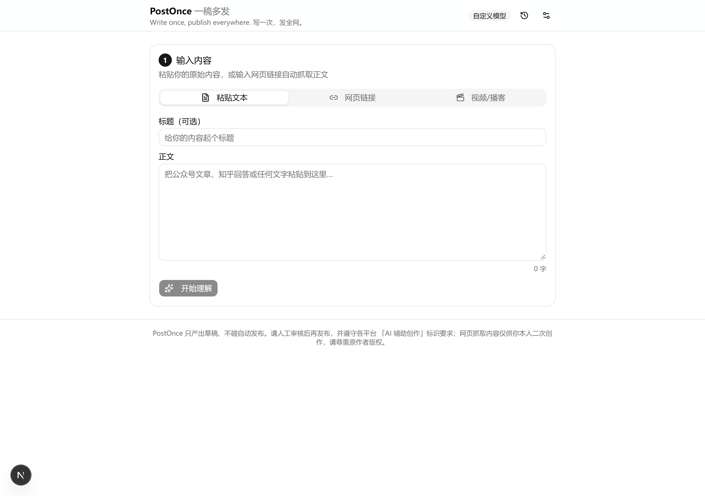



# PostOnce · 一稿多发

> **Write once, publish everywhere. 写一次，发全网。**
>
> 开源的 AI 跨平台内容二创 Agent：输入一次内容（粘贴文本 / 网页链接），自动产出适配**小红书**与**公众号**的发布级草稿——标题候选、正文、话题标签、3:4 封面图、富文本排版，人工确认后一键复制导出。

**English summary**: PostOnce is an open-source AI content-repurposing agent. Paste text or drop a link, and it drafts platform-native posts (Xiaohongshu / WeChat Official Account) with title candidates, tags, covers and rich-text layout, using any OpenAI-compatible LLM (BYOK supported). Built with Next.js App Router + Vercel AI SDK + satori.

## 演示

| ① 输入（粘贴文本 / 网页链接） | ② AI 结构化理解（全字段可编辑） |
| --- | --- |
|  |  |

| ③ 双平台草稿（逐平台编辑/重生成） | ④ 封面工作台（3 套模板秒出图） |
| --- | --- |
|  |  |

## 功能

- **双通道输入**：粘贴文本，或输入网页链接由服务端抓取正文（桌面 UA + Readability 提取，带 SSRF 防护）
- **内容理解**：LLM 结构化输出总结 / 要点 / 目标读者 / 调性 / 金句，全部可编辑、可重新生成
- **平台改写（并行、互不影响，5 个平台可勾选）**：
  - 小红书：3-8 个 ≤20 字标题候选、emoji 分段口语化正文（≤800 字）、5-10 个话题标签、封面文案
  - 公众号：3-8 个标题候选、内联样式富文本排版（小标题/引用块/加粗/分割线）、≤120 字摘要
  - 知乎：3-8 个问题式/观点式标题（≤30 字）、Markdown 回答体正文（小标题+列表+加粗，≤2000 字）
  - 微博：≤140 字短文案（前 20 字定生死，1-2 个 emoji）、2-4 个话题词、可选长微博版本（≤500 字）
  - 头条：3-8 个信息量标题（≤30 字）、资讯感正文（段落清晰，≤1500 字）
- **模板封面**：3 套程序化模板（纯色大字 / 渐变 / 左右分栏），satori + resvg 秒出 900×1200 PNG，可预览下载
- **人在回路**：每个产出块可编辑、可单独重新生成；单平台失败不影响另一平台
- **账单透明**：每次生成实时显示 token 用量
- **模型可插拔**：GLM / DeepSeek / 通义 / Kimi / OpenAI 预设（OpenAI 兼容接口），默认 GLM-Flash 免费模型；支持 BYOK（密钥仅存浏览器 localStorage）
- **无登录无数据库**：历史记录存浏览器 localStorage（最多 20 条）
- **内存限流**：单 IP 每日 50 次（可用 `RATE_LIMIT_PER_DAY` 调整）

## 快速开始

```bash
npm install
cp .env.example .env.local   # 填入你的模型 API Key
npm run dev                  # http://localhost:3000
```

最小可用配置（不改代码、不用数据库）：

```ini
# .env.local
MODEL_PROVIDER=glm
GLM_API_KEY=你的智谱密钥        # glm-4-flash 目前免费；也可用其他预设或 BYOK
```

生产构建：`npm run build && npm start`。

### 中文字体（封面渲染必需）

封面渲染（satori）需要 CJK 字体，且**仅支持 ttf/otf/woff，不支持 woff2/ttc**。仓库自带 `assets/fonts/NotoSansSC-Regular.ttf` 与 `NotoSansSC-Bold.ttf`（[Noto Sans SC](https://fonts.google.com/noto/fonts)，OFL 协议，可商用）。若字体文件缺失（如克隆时未包含），手动放置以下任一字体到 `assets/fonts/` 即可（代码按文件名自动探测）：

- `NotoSansSC-Regular.ttf` + `NotoSansSC-Bold.ttf`（推荐；如只能找到可变字体 `NotoSansSC[wght].ttf`，satori 无法解析其 fvar 表，需先用 `fonttools varLib.instancer` 实例化为静态字重）
- 或 `AlibabaPuHuiTi-3-55-Regular.ttf` / `AlibabaPuHuiTi-3-85-Bold.ttf`（阿里巴巴普惠体，免费商用）
- 或 `SourceHanSansSC-Regular.otf` / `SourceHanSansSC-Bold.otf`（思源黑体，OFL）

字体缺失时 `/api/cover` 会返回明确的中文错误提示，其余功能不受影响。

## 配置

| 环境变量 | 说明 |
|---|---|
| `MODEL_PROVIDER` | 预设厂商：`glm`（默认）/ `deepseek` / `qwen` / `kimi` / `openai` |
| `GLM_API_KEY` 等 | 各预设对应密钥（见 `.env.example`） |
| `RATE_LIMIT_PER_DAY` | 单 IP 每日请求上限，默认 50 |

前端「设置」面板支持 BYOK：填写 OpenAI 兼容的 baseURL / API Key / 模型名，仅存 localStorage，请求经自定义 header（`x-postonce-base-url` 等）传给后端，服务端不写日志。

## API

| 方法 | 路由 | 说明 |
|---|---|---|
| `POST` | `/api/ingest` | `{url}` → 抓取并提取 `{title, content, excerpt, sourceUrl}` |
| `POST` | `/api/understand` | `{title, content}` → 结构化理解 + token usage |
| `POST` | `/api/adapt` | `{title, content, analysis, platforms[]}` → 并行产出各平台草稿，分平台成功/失败 |
| `POST` | `/api/cover` | `{template, main, sub}` → `image/png` 封面（900×1200） |
| `GET` | `/api/config` | 服务端预设与密钥配置状态（不含密钥） |

## Roadmap

完整设计见 [docs/design.md](docs/design.md)，分期如下：

- **M1**：文本/链接输入 → 内容理解 → 小红书 + 公众号草稿 → 模板封面 → 编辑导出 ✅
- **M2**：在线 Demo（Vercel）+ BYOK + 限流完善 + README 演示 GIF
- **M3**：知乎 / 微博 / 头条三平台适配，五平台并行输出 ✅（单平台失败不影响整体）
- **M4**：B 站 / 播客链接 → 转写 → 流水线（自托管 Docker）
- **M5**：发布推广与 dogfooding 闭环

## 合规与声明

- 本项目**不接入任何平台的自动发布 API**，产出物均为草稿，请人工审核后再发布
- 请遵守各平台「AI 辅助创作」内容标识要求
- 网页抓取内容仅供你本人二次创作使用，请尊重原作者版权

## License

[Apache-2.0](LICENSE)
